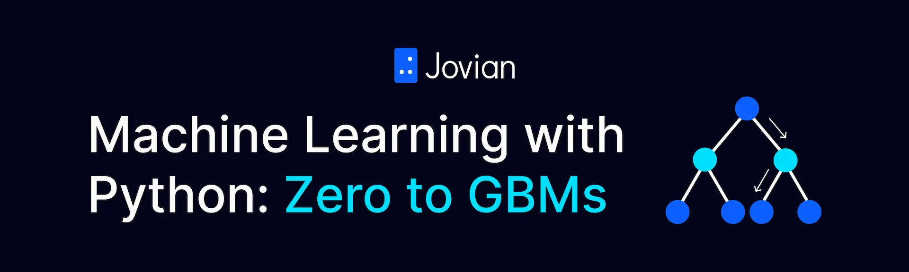

# Machine Learning with Python - Zero to GBMS

# Lessions

## [Lession 01 - Linear Regression with Scikit Learn](lession_01/python_sklearn_linear_regression.ipynb)

- Preparing data for machine learning
- Linear regression with multiple features
- Generating predictions and evaluating models

## [Lession 02 - Logistic Regression for Classification](lession_02/python_sklearn_logistic_regression.ipynb)

- Downloading & processing Kaggle datasets
- Training a logistic regression model
- Model evaluation, prediction & persistence

## [Lession 03 - Decisition Trees and Hypterparameters](lession_03/sklearn_decision_trees_random_forests.ipynb)

- Downloading a real-world dataset
- Preparing a dataset for training
- Training & interpreting decision trees

# Assignments

## [Assignment 01 - Train your First ML Model](assignment_01/python_sklearn_assignment.ipynb)

- Download and prepare a dataset for training
- Train a linear regression model using sklearn
- Make predictions and evaluate the model
